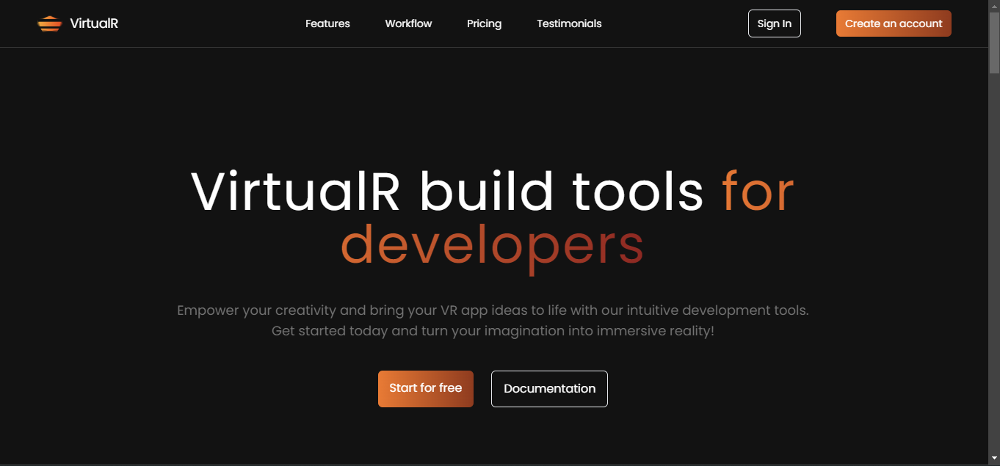

# VirtualR Website / Landing Page

The VirtualR website is a react / tailwind css website / landing page for a fictional company that develops software tools virtual reality developers.

## Project Specifications

- Create Responsive UI for project
- Website / landing page built with React and Tailwind CSS
- The landing page for a fictional company that develops tool virtual reality developers
